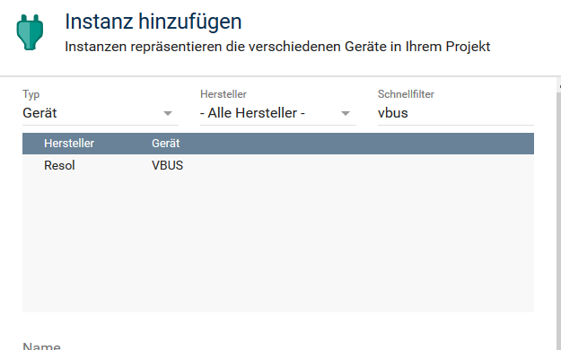
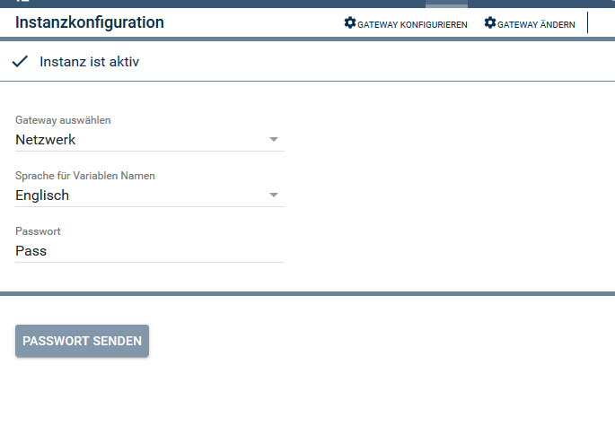

# Modul zur Einbindung von Resol Solarreglern in IP-Symcon

[]

Folgende Module beinhaltet die Repository:

- __VBUS__ ([Dokumentation](VBUS))  

	Die Resol Solarregler senden sekündlich den Status der Sensoren und weitere Werte auf den "VBUS".
	Über einen LAN oder RS232 Adapter können diese Werte abgegriffen werden. 

	Das Modul dient zum Empfang von Daten über den "V-Bus".
	Die Daten werden entsprechend ihrer Bedeutung aufbereitet und in IPS Variablen abgelegt.
	Die Variablennamen können umbennant werden, müssen aber unter der Instanz bleiben.
	Bekannte Formate bekommen automatisch ein Variablenprofil, alle anderen müssen manuell eines zugewiesen bekommen. 

- __Voraussetzung__

IPS Version mindestens 4.2

- __Installation__

Nach hinzufügen des Moduls, kann einen neue Instanz angelegt werden.
Dazu nach "VBUS" oder "Resol" suchen.

- __Einstellungen__

In der Instanz können folgende Einstellungen vorgenommen werden.
- Gateway:	Auswahl ob LAN (Netzwerk) oder RS232 (Seriell) Adapter
- Sprache für Variablennamen: In der Beschreibung der Werte sind Deutsche und zum Teil Englische, Bezeichnungen. Je nach Auswahl werden die IPS Variablen entsprechend angelegt. Ein nachträgliches Ändern ist jederzeit möglich.
- Passwort: Der LAN Adapter sendet erst Daten, wenn über die Schnittstelle eine Passwort gesendet wird.  
	Standart: vbus.  
	Dieses wird gesendet nach Übernehmen von Änderungen in der Konfiguration oder mit dem Button "Passwort Senden".  
	Gilt nur für den LAN Adapter. Für die RS232 Schnitstelle hat es keine Relevanz.

- __Funktionen__

Resol_SendPass();

Mit der Funktion kann das Passwort manuell an den LAN Adapter gesendet werden.

- __Changelog__
1. | V1.0 | Grundversion
